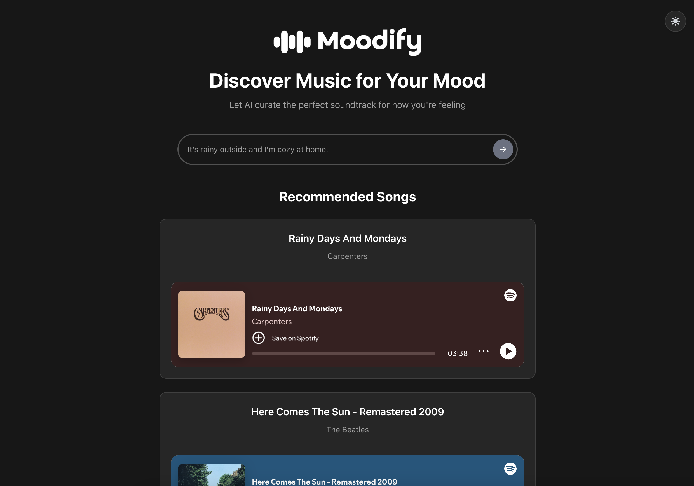

_Your mood becomes music through the magic of AI._

[🌐 Live Demo](https://moodify.osuke.dev/)

Moodify is an intelligent music recommendation application that suggests songs based on your mood descriptions. Using the power of Google's Gemini AI and Spotify's extensive music database, Moodify provides personalized song recommendations that match your emotional state.



## ✨ Features

- 🤖 AI-powered mood analysis using Google's Gemini
- 🎧 Integration with Spotify's music database
- 🎯 Smart retry mechanism for failed track searches
- 🎨 Clean and intuitive user interface
- 📱 Responsive design for all devices

## 🚀 Getting Started

### Prerequisites

- Node.js (v14 or higher)
- Yarn package manager
- Spotify Developer Account
- Google Cloud Account with Gemini API access

### Environment Variables Setup

Before running the application, you need to set up your environment variables:

1. **Create a `.env` file** in the root directory of your project
2. **Add your API credentials** to the `.env` file:

```env
# Spotify API Credentials
VITE_SPOTIFY_CLIENT_ID=your_spotify_client_id_here
VITE_SPOTIFY_CLIENT_SECRET=your_spotify_client_secret_here

# Google Gemini API Key
VITE_GEMINI_API_KEY=your_gemini_api_key_here
```

#### How to Get Your API Keys:

**Spotify API:**

1. Go to [Spotify Developer Dashboard](https://developer.spotify.com/dashboard)
2. Create a new application
3. Copy the Client ID and Client Secret

**Google Gemini API:**

1. Go to [Google AI Studio](https://makersuite.google.com/app/apikey)
2. Create a new API key
3. Copy the generated API key

#### Security Notes:

- ⚠️ **Never commit your `.env` file to version control**
- ✅ The `.env` file is already included in `.gitignore`
- 🔒 Keep your API keys secure and don't share them publicly
- 🔄 Consider rotating your API keys regularly for better security

### Installation

1. Clone the repository:

```bash
git clone https://github.com/ozgegurel/moodify.git
cd moodify
```

2. Install dependencies:

```bash
yarn install
```

3. Start the development server:

```bash
yarn dev
```

## 🛠️ Tech Stack

- React
- Vite
- Tailwind CSS
- Google Gemini AI API
- Spotify Web API

## 📝 How It Works

1. Enter your mood or emotional state in the input field
2. The application uses Gemini AI to analyze your mood and generate song recommendations
3. These recommendations are then searched in Spotify's database
4. If some tracks aren't found, the system intelligently retries with alternative suggestions
5. Finally, you get a curated list of songs that match your mood

## 🤝 Contributing

Contributions are welcome! Please feel free to submit a Pull Request.

## 📄 License

This project is licensed under the MIT License - see the [LICENSE](LICENSE) file for details.

## 🙏 Acknowledgments

- Google Gemini AI for mood analysis
- Spotify for music database access
- All contributors and users of Moodify
